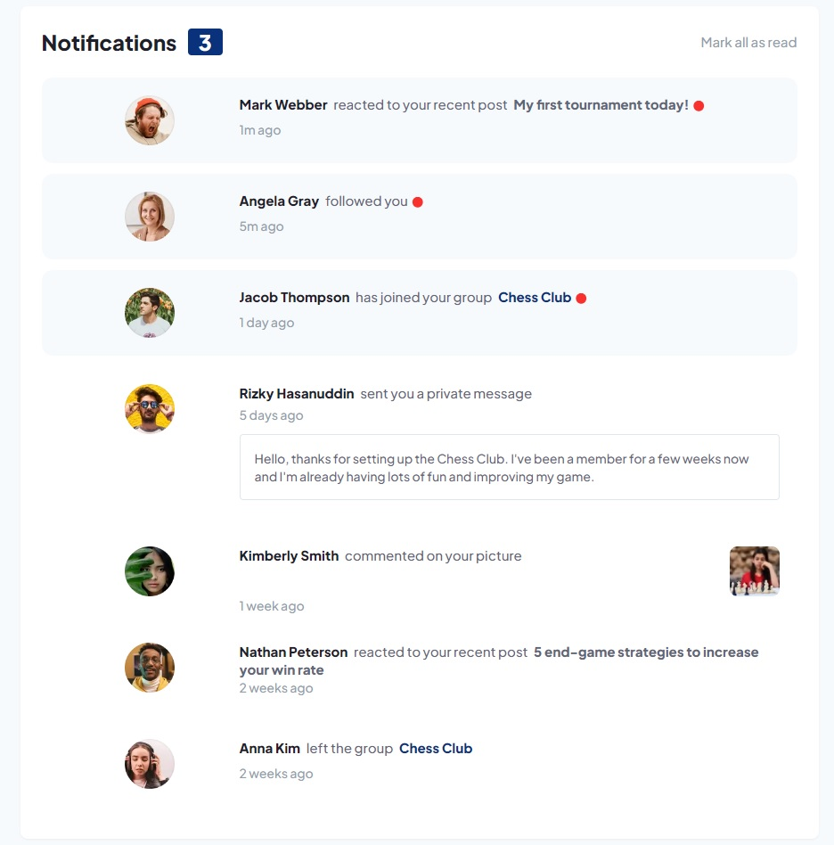

# Frontend Mentor - Notifications page

This is a solution to the [Notifications page challenge on Frontend Mentor](https://www.frontendmentor.io/challenges/notifications-page-DqK5QAmKbC). Frontend Mentor challenges help you improve your coding skills by building realistic projects.

## Table of contents

- [Overview](#overview)
  - [Screenshot](#screenshot)
  - [Links](#links)
  - [Built with](#built-with)
- [Author](#author)

## Overview

Users should be able to:

- Distinguish between "unread" and "read" notifications
- Select "Mark all as read" to toggle the visual state of the unread notifications and set the number of unread messages to zero
- View the optimal layout for the interface depending on their device's screen size
- See hover and focus states for all interactive elements on the page

### Screenshot

### Links

- Solution URL: [Frontend Mentor](https://www.frontendmentor.io/solutions/notifications-page-using-tailwind-css-and-grid-Y4Z5WCCoNK)
- Live Site URL: [GitHub Page](https://nastaj.github.io/notifications-page/)

### Built with

- Semantic HTML5 markup
- Tailwind CSS
- CSS Grid
- JavaScript

## Author

- Frontend Mentor - [@nastaj](https://www.frontendmentor.io/profile/nastaj)
- Discord - [@aseirel]
